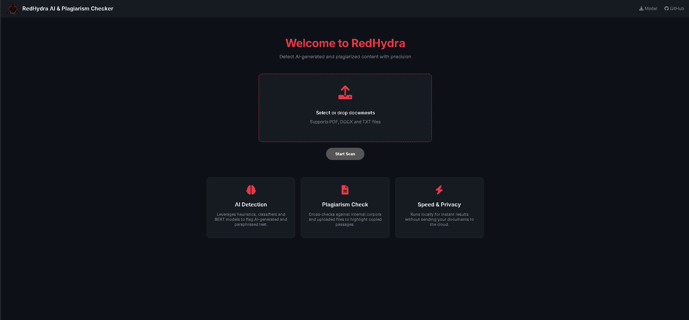

# 🔴 RedHydra AI & Plagiarism Checker

<p align="center">
  
</p>

<p align="center">
  
</p>

<p align="center">
  
</p>

---

<p align="center">
  <b>Next‑Generation • Offline • Explainable • Unlimited</b><br>
  <i>Precision AI & Plagiarism Detection with Advanced Visual Intelligence</i>
</p>

---

## 🎯 Purpose

**RedHydra AI & Plagiarism Checker** is an advanced, open‑source system built to:

- Detect **AI‑generated writing**
- Detect **AI‑paraphrased / humanized content**
- Identify **plagiarism with sentence‑level accuracy**
- Provide **transparent, explainable reports**
- Operate **fully offline** with unlimited usage

RedHydra is designed for **educators, researchers, publishers, and developers** who need trustworthy academic‑integrity signals without relying on opaque cloud services.

---

## 🚀 Core Features

### 🧠 AI Writing Detection
- Raw AI text detection
- AI‑generated → paraphrased / humanized detection
- Resistant to AI bypass tools
- Uses:
  - Perplexity normalization
  - Burstiness compression
  - Token entropy
  - Character‑level TF‑IDF instability
  - Classifier probability blending

### ✍️ Plagiarism Detection
- TF‑IDF cosine similarity
- N‑gram overlap analysis
- Sentence‑level plagiarism highlighting
- Multi‑document cross‑comparison

### 🟣 AI‑Paraphrased Writing Detection
- Identifies AI text rewritten by:
  - Paraphrasers
  - AI humanizers
  - Spinners
- Highlights paraphrased sentences separately
- Acts **only on AI‑pre‑flagged segments** (low false positives)

### 📊 Reports & Visualization
- Modern animated Flask dashboard
- Interactive charts
- Color‑coded highlights:
  - 🔴 Plagiarism
  - 🟠 AI‑generated
  - 🟣 AI‑paraphrased
- Export:
  - HTML report (full text)
  - PDF report (charts + summary)

### 🎨 Animated & Modern UI
- Dark cyber‑themed interface
- Smooth CSS transitions & hover effects
- Animated progress bars
- Dynamic result rendering
- Responsive layout

---

## 🖥️ Running the Dashboard

```bash
py -3 AII.py flask
```

Then open:
```
http://127.0.0.1:5000
```

---

## 🧪 Command‑Line Usage (CLI)

Analyze documents:
```bash
py -3 AII.py file1.docx file2.pdf
```

Train AI classifier:
```bash
py -3 AII.py train_ai
```

Evaluate AI model:
```bash
py -3 AII.py eval_ai
```

---

## 📥 External AI Model Support

RedHydra supports **downloading and switching external Hugging Face models**.

Example model:
```
followsci/bert-ai-text-detector
```

After download:
- Cached locally
- Used automatically for scans
- No internet required afterward

---

## 🟢 False Positive Control

- Scores **1%–19%** masked as *Low Risk*
- Detailed percentages shown only ≥ 20%
- Reduces academic false positives
- Designed for fairness & transparency

---

## 🎓 Use Cases

- Academic integrity checks
- Research paper screening
- Publisher pre‑review
- AI‑policy compliance
- Offline institutional audits

---

## 🔒 Privacy & Ethics

- No cloud calls
- No data uploads
- No telemetry
- Full local control

> RedHydra informs — it does not accuse.

---

## 🔗 Author

- GitHub: https://github.com/root60

---

## 📜 License

Open‑source  
Free for personal, educational, and research use.

---

<p align="center">
<b>RedHydra — Precision over paranoia.</b>
</p>
