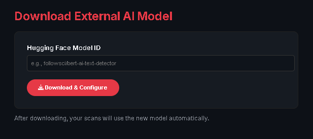

# 🔴 RedHydra AI & Plagiarism Checker

<p align="center">
  
  
  
</p>

---

**RedHydra** is an advanced, offline-first AI & plagiarism detection system.

It detects:
- AI-generated text
- AI-paraphrased (humanized) text
- Plagiarism with sentence-level highlighting

---

## 🚀 Features
- Offline & unlimited usage
- AI + AI-paraphrase detection
- Plagiarism comparison (multi-file)
- Modern animated dashboard
- HTML & PDF export
- External Hugging Face model support

---

## ▶ Run Dashboard
```bash
py -3 AII.py flask
```

Open: http://127.0.0.1:5000

---

## 🧪 CLI Usage
```bash
py -3 AII.py file1.docx file2.pdf
py -3 AII.py train_ai
py -3 AII.py download_model followsci/bert-ai-text-detector
```

---

## 📊 Highlight Legend
- 🔴 Red: Plagiarism
- 🟠 Orange: AI-generated
- 🟣 Purple: AI-paraphrased

---

GitHub: https://github.com/root60

**RedHydra — Precision over paranoia.**
