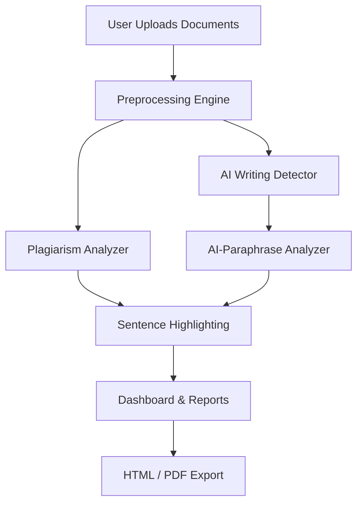

<!-- ===================== REDHYDRA README ===================== -->

<p align="center">
  
</p>

<h1 align="center">RedHydra AI & Plagiarism Checker</h1>

<p align="center">
  <b>Offline • Explainable • Unlimited • Research‑Grade</b><br/>
  Advanced AI‑Writing, AI‑Paraphrase & Plagiarism Detection Engine
</p>

<p align="center">
  <!-- Animated / Dynamic SVG Badges -->
  
  
  
  
  
</p>

---

## 🔥 Visual Overview

<p align="center">
  
</p>

<p align="center">
  
</p>

<p align="center">
  
</p>

---

## 🎯 Purpose

**RedHydra** is built to solve a modern problem:

> _How do we reliably detect AI‑generated and AI‑paraphrased writing **without cloud services, black boxes, or usage limits**?_

RedHydra answers this by combining:
- Transparent heuristics
- Offline ML classifiers
- Transformer‑based AI detectors
- Visual, explainable reporting

---

## ⚙️ System Architecture



---

## 🧠 Detection Capabilities

### AI Writing Detection
- Raw AI‑generated text
- GPT‑style probability smoothing
- Perplexity + burstiness metrics
- Transformer classifier support

### AI‑Paraphrased Detection
- Detects AI → paraphraser → output
- Synonym density analysis
- Structural instability signatures
- Operates only on AI‑flagged segments (low false positives)

### Plagiarism Detection
- Multi‑file similarity
- TF‑IDF + N‑gram overlap
- Sentence‑level plagiarism highlighting
- Cover & bibliography exclusion

---

## 🎨 Highlight Legend

| Color | Meaning |
|------|--------|
| 🔴 Red | Plagiarism |
| 🟠 Orange | AI‑Generated |
| 🟣 Purple | AI‑Generated + Paraphrased |

---

## 🖥 Running the Dashboard

```bash
py -3 AII.py flask
```

Open:
```
http://127.0.0.1:5000
```

---

## 🧪 Command‑Line Usage

Analyze documents:
```bash
py -3 AII.py file1.docx file2.pdf
```

Train AI classifier:
```bash
py -3 AII.py train_ai
```

Download external AI model:
```bash
py -3 AII.py download_model followsci/bert-ai-text-detector
```

---

## 🌍 GitHub Pages (Landing Page)

RedHydra is ready for **GitHub Pages**.

### Suggested setup
```
/docs
 ├── index.html
 ├── styles.css
 └── assets/
```

Use the README visuals + architecture diagram as your landing content.

---

## 🔐 Privacy & Ethics

- No cloud calls
- No telemetry
- No tracking
- Unlimited local use

> RedHydra is a **decision‑support system**, not an accusation engine.

---

## 🔗 Links

- GitHub: https://github.com/root60

---

<p align="center">
<b>RedHydra — engineered for trust, not fear.</b>
</p>
